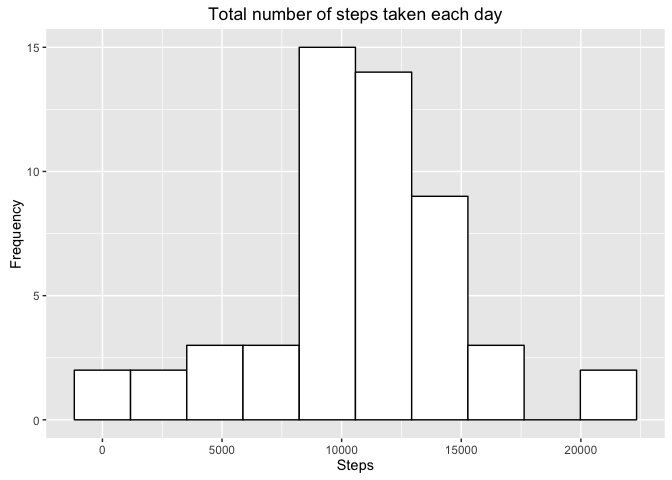
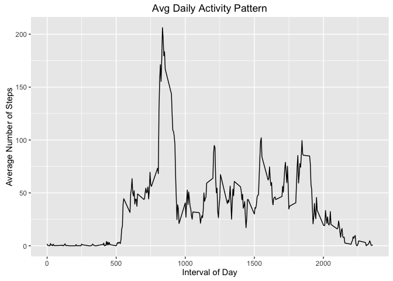
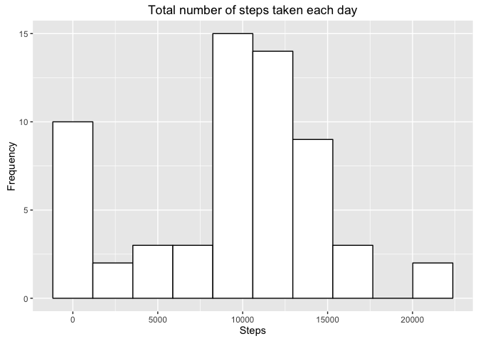
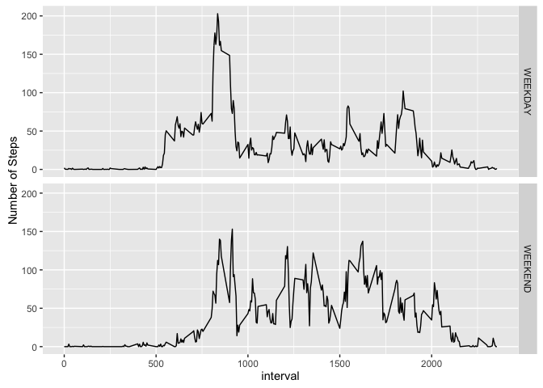

# Reproducible Research: Peer Assessment 1
Devender R. Gollapally  

## Introduction

Using the data from a personal activity monitoring device we will try to answer the following questions:

1. **What is mean total number of steps taken per day ?**
2. **What is the average daily activity pattern ?**
3. **Are there differences in activity patterns between weekdays and weekends ?**

The device used, collects data at 5 minute intervals. The data consists of two months collected during the months of October and November, 2012 and include the number of steps taken each day.

## Data Source

The data used in this assignment can be downloaded from this [Link](https://d396qusza40orc.cloudfront.net/repdata%2Fdata%2Factivity.zip) on the course website, it is also included in the [github repository](https://github.com/devender/RepData_PeerAssessment1).

##### R workspace setup

```r
library(data.table)
library(dplyr)
library(ggplot2)
library(lubridate)

# Setup Working dir
setwd("/Users/Devender/RepData_PeerAssessment1")
# Clean up work space
rm(list=ls())
gc()
if(!file.exists("activity.csv")){
    unzip("activity.zip")
}
```

## Loading and preprocessing the data
Reading the CSV file into a data frame so that we can use if for later processing.

```r
activityData <- read.csv("activity.csv", header= T, na.strings = c("NA"), stringsAsFactors = F)
str(activityData)
```

```
## 'data.frame':	17568 obs. of  3 variables:
##  $ steps   : int  NA NA NA NA NA NA NA NA NA NA ...
##  $ date    : chr  "2012-10-01" "2012-10-01" "2012-10-01" "2012-10-01" ...
##  $ interval: int  0 5 10 15 20 25 30 35 40 45 ...
```

## What is mean total number of steps taken per day ?

Subsetting the data and grouping by each day, gives us total number of steps for each day.


```r
stepsByDay <- activityData %>% 
                select(steps, date) %>% 
                filter(!is.na(steps)) %>%
                group_by(date) %>% 
                summarise(total_steps = sum(steps))
head(stepsByDay)
```

```
## Source: local data frame [6 x 2]
## 
##         date total_steps
##        (chr)       (int)
## 1 2012-10-02         126
## 2 2012-10-03       11352
## 3 2012-10-04       12116
## 4 2012-10-05       13294
## 5 2012-10-06       15420
## 6 2012-10-07       11015
```
Using the above data we can plot a **histogram** of the total number of steps taken each day


```r
ggplot(stepsByDay, aes(x=total_steps)) + 
    geom_histogram(colour="black", fill="white", bins=10)+
    xlab("Steps") +ylab("Frequency") +
    ggtitle("Total number of steps taken each day")
```



##### Calculate and report the mean and median of the total number of steps taken per day:

```r
mean(stepsByDay$total_steps, na.rm =TRUE)
```

```
## [1] 10766.19
```

```r
median(stepsByDay$total_steps, na.rm=TRUE)
```

```
## [1] 10765
```


## What is the average daily activity pattern?
Lets compute during what times of the day the person is more active.

```r
avgActivityPattern <- activityData %>%
    filter(!is.na(steps)) %>%
    group_by(interval) %>% 
    summarise(avg_steps = mean(steps))

ggplot(avgActivityPattern, aes(x=interval)) + 
    geom_line( aes(y=avg_steps)) +
    xlab("Interval of Day") +ylab("Average Number of Steps") +
    ggtitle("Avg Daily Activity Pattern")
```



##### The 5-minute interval that, on average, contains the maximum number of steps:

```r
avgActivityPattern %>% arrange(desc(avg_steps)) %>% select(interval) %>% head(1) %>% as.numeric
```

```
## [1] 835
```
## Imputing missing values

Lets find out how just many rows have NA.

##### Calculate and report the total number of missing values in the dataset (i.e. the total number of rows with 𝙽𝙰s):

```r
numOfRowsWithNA <- activityData %>% 
                filter(is.na(steps)) %>% 
                summarise(n()) %>% 
                as.numeric()

totalRows <- nrow(activityData)
numOfRowsWithNA
```

```
## [1] 2304
```
The Number of rows with NA is 2304 it represents 13.1147541 percent. Since this is a rather significant percentage we will fill in this missing data with out best guess.

##### Strategy for filling in all of the missing values in the dataset:

Create a new dataset with fixed na steps replaced with 0.


```r
activityDataFixed = within(activityData, {
    steps = ifelse(is.na(steps), 0 , steps)
})
str(activityDataFixed)
```

```
## 'data.frame':	17568 obs. of  3 variables:
##  $ steps   : num  0 0 0 0 0 0 0 0 0 0 ...
##  $ date    : chr  "2012-10-01" "2012-10-01" "2012-10-01" "2012-10-01" ...
##  $ interval: int  0 5 10 15 20 25 30 35 40 45 ...
```
Now that we have created a new column with the mising steps fixed lets recreate the histogram to see if there is a difference


```r
stepsByDayFixed <- activityDataFixed %>% 
                select(steps, date) %>% 
                group_by(date) %>% 
                summarise(total_steps = sum(steps))
head(stepsByDayFixed)
```

```
## Source: local data frame [6 x 2]
## 
##         date total_steps
##        (chr)       (dbl)
## 1 2012-10-01           0
## 2 2012-10-02         126
## 3 2012-10-03       11352
## 4 2012-10-04       12116
## 5 2012-10-05       13294
## 6 2012-10-06       15420
```
Using the above data we can plot a **histogram** of the total number of steps taken each day


```r
ggplot(stepsByDayFixed, aes(x=total_steps)) + 
    geom_histogram(colour="black", fill="white", bins=10)+
    xlab("Steps") +ylab("Frequency") +
    ggtitle("Total number of steps taken each day")
```



##### Calculate and report the mean and median of the total number of steps taken per day:

```r
mean(stepsByDayFixed$total_steps)
```

```
## [1] 9354.23
```

```r
median(stepsByDayFixed$total_steps)
```

```
## [1] 10395
```

### Impact of imputing missing data

We see that by imputing the missing data with 0 effects both the density functions (mean and median).

## Are there differences in activity patterns between weekdays and weekends?
First we will add another column to indicate if it is a weekend or a weekday.


```r
isWeekend <- function(dt){
    if(weekdays(ymd(dt)) %in% c("Sunday","Saturday")){
        return("WEEKEND")
    }else{
        return("WEEKDAY")
    }
}

activityDataFixed=activityDataFixed %>% rowwise() %>% mutate(wday = isWeekend(date))
```
Next we will plot Average by weekday and weekend.


```r
compareWeekdayVsWeekend <- activityDataFixed %>% 
    group_by(wday,interval) %>% 
    summarise(mean=mean(steps))
```

```
## Warning: Grouping rowwise data frame strips rowwise nature
```

```r
ggplot(compareWeekdayVsWeekend, aes(x = interval, y = mean)) + ylab("Number of Steps") + geom_line() + facet_grid(wday~.)
```



From the above comparison we can clearly see there is a difference between weekdays and weekends.
